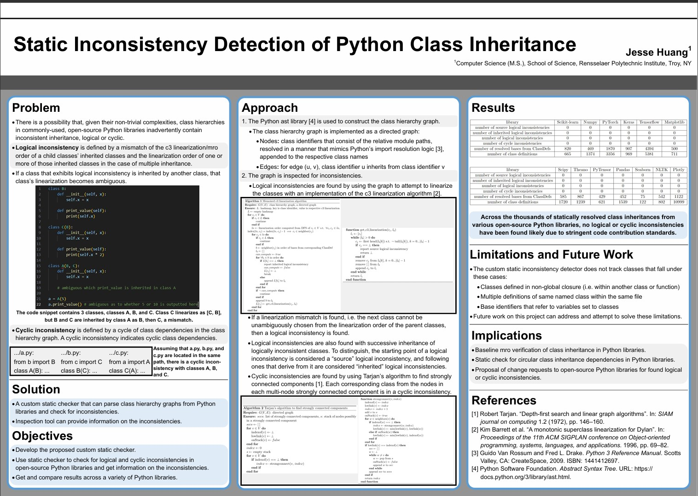

# Inconsistency Checker
This tool is a Python code analyzer that can find method resolution order (MRO) and cyclic inconsistencies in Python libraries. A MRO inconsistency, a mismatch of the declared inheritance order of a class's parent classes and the MRO of one or more of those parent classes, is referred to as a logical inconsistency in this repository. A cyclic inconsistency refers to a cycle of class dependencies in class inheritance. See the [poster](https://github.com/JessHua159/inconsistency-checker/blob/main/poster.pdf) for more details.

<figure>
    <a href="poster.pdf">
        
    </a>
</figure>

## Usage
1. Generate the class hierarchy graph pickle dump file with
```
python get_class_hierarchy_graph.py [path to Python source code]
```
The path can be to either a Python script or a folder that contains Python source code.
`get_class_hierarchy_graph.py` creates a folder named `class_hierarchy_graphs` if not created and generates the pickle dump file in that folder: `class_hierarchy_graphs/<name of Python script or folder>_class_hierarchy_graph.pkl`.

2. Use the following script to scan the class hierarchy graph stored in the pickle dump file for logical and cyclic inconsistencies:
```
python check_inheritance_consistency.py [path to pickle dump file]
```
If found, the script outputs found logical and cyclic inconsistencies and creates folders `source_logical_inconsistent_info` and `cycle_inconsistent_info` if not created. Information on found logical inconsistencies is dumped in `source_logical_inconsistent_info/<name of Python script or folder>.txt`, and information on found cyclic inconsistencies is dumped in `cycle_inconsistent_info/<name of Python script or folder>.txt`.

The output has names of classes prepended by the path in dot notation relative to the root of the provided source code. For example, class `X` in `sample_inconsistent_codebase/a.py` is referred to as `sample_inconsistent_codebase.a.X`.

## Example Usage
```
python get_class_hierarchy_graph.py sample_inconsistent_codebase
python check_inheritance_consistency.py class_hierarchy_graphs\sample_inconsistent_codebase_class_hierarchy_graph.pkl
```